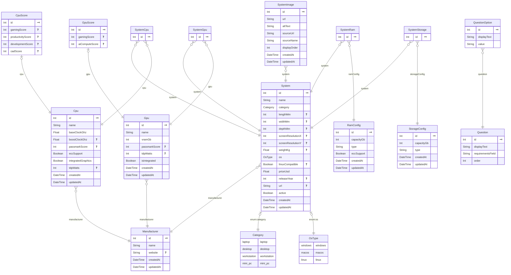

```mermaid
erDiagram

        OsType {
            windows windows
macos macos
linux linux
        }
    


        Category {
            laptop laptop
desktop desktop
workstation workstation
mini_pc mini_pc
        }
    
  "Manufacturer" {
    Int id "🗝️"
    String name 
    String website "❓"
    DateTime createdAt 
    DateTime updatedAt 
    }
  

  "Cpu" {
    Int id "🗝️"
    String name 
    Float baseClockGhz 
    Float boostClockGhz "❓"
    Int passmarkScore "❓"
    Boolean eccSupport 
    Boolean integratedGraphics 
    Int tdpWatts "❓"
    DateTime createdAt 
    DateTime updatedAt 
    }
  

  "Gpu" {
    Int id "🗝️"
    String name 
    Int vramGb 
    Int passmarkScore "❓"
    Int tdpWatts "❓"
    Boolean isIntegrated 
    DateTime createdAt 
    DateTime updatedAt 
    }
  

  "RamConfig" {
    Int id "🗝️"
    Int capacityGb 
    String type 
    Boolean eccSupport 
    DateTime createdAt 
    DateTime updatedAt 
    }
  

  "StorageConfig" {
    Int id "🗝️"
    Int capacityGb 
    String type 
    DateTime createdAt 
    DateTime updatedAt 
    }
  

  "SystemImage" {
    Int id "🗝️"
    String url 
    String altText 
    String sourceUrl 
    String sourceName 
    Int displayOrder 
    DateTime createdAt 
    DateTime updatedAt 
    }
  

  "System" {
    Int id "🗝️"
    String name 
    Category category 
    Int lengthMm "❓"
    Int widthMm "❓"
    Int depthMm "❓"
    Int screenResolutionX "❓"
    Int screenResolutionY "❓"
    Float weightKg "❓"
    OsType os 
    Boolean linuxCompatible "❓"
    Float priceUsd 
    Int releaseYear "❓"
    String url "❓"
    Boolean active 
    DateTime createdAt 
    DateTime updatedAt 
    }
  

  "SystemCpu" {
    Int id "🗝️"
    }
  

  "SystemGpu" {
    Int id "🗝️"
    }
  

  "SystemRam" {
    Int id "🗝️"
    }
  

  "SystemStorage" {
    Int id "🗝️"
    }
  

  "CpuScore" {
    Int id "🗝️"
    Int gamingScore "❓"
    Int productivityScore "❓"
    Int developmentScore "❓"
    Int cadScore "❓"
    }
  

  "GpuScore" {
    Int id "🗝️"
    Int gamingScore "❓"
    Int aiComputeScore "❓"
    }
  

  "Question" {
    Int id "🗝️"
    String displayText 
    String requirementsField 
    Int order 
    }
  

  "QuestionOption" {
    Int id "🗝️"
    String displayText 
    String value 
    }
  
    "Cpu" }o--|| "Manufacturer" : "manufacturer"
    "Gpu" }o--|| "Manufacturer" : "manufacturer"
    "SystemImage" }o--|| "System" : "system"
    "System" }o--|| "Manufacturer" : "manufacturer"
    "System" |o--|| "Category" : "enum:category"
    "System" |o--|| "OsType" : "enum:os"
    "SystemCpu" }o--|| "System" : "system"
    "SystemCpu" }o--|| "Cpu" : "cpu"
    "SystemGpu" }o--|| "System" : "system"
    "SystemGpu" }o--|| "Gpu" : "gpu"
    "SystemRam" }o--|| "System" : "system"
    "SystemRam" }o--|| "RamConfig" : "ramConfig"
    "SystemStorage" }o--|| "System" : "system"
    "SystemStorage" }o--|| "StorageConfig" : "storageConfig"
    "CpuScore" |o--|| "Cpu" : "cpu"
    "GpuScore" |o--|| "Gpu" : "gpu"
    "QuestionOption" }o--|| "Question" : "question"
```
